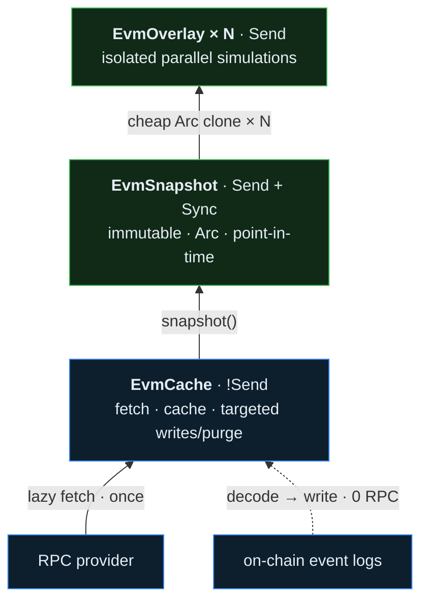
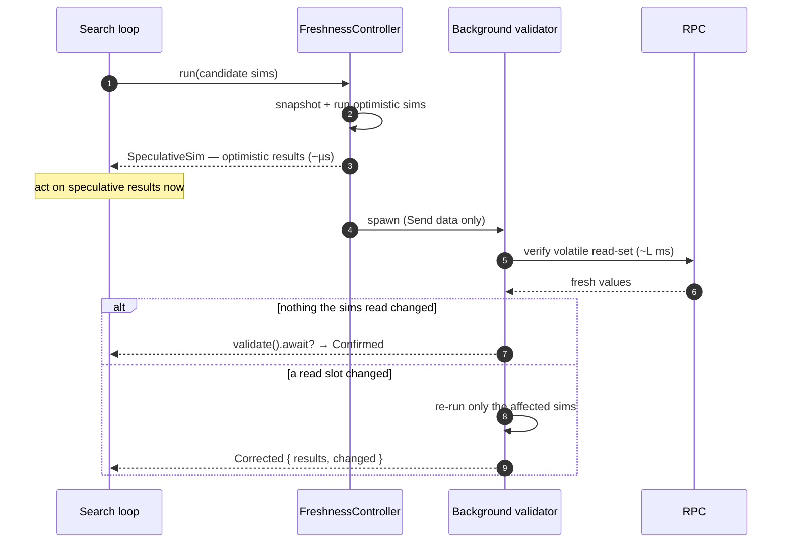
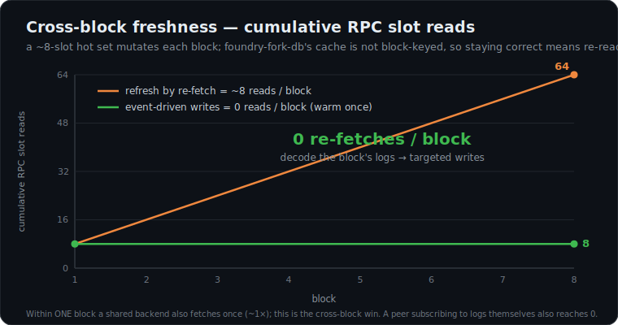

# evm-fork-cache

[](https://github.com/KaiCode2/evm-fork-cache/actions/workflows/ci.yml)
[](https://crates.io/crates/evm-fork-cache)
[](https://docs.rs/evm-fork-cache)
[](#license)

A forked-EVM **simulation engine** for EVM search, MEV, and backtesting — built
on [`revm`], [`alloy`], and [`foundry-fork-db`].

It exists to answer one question fast and repeatedly: *"if I sent this
transaction against current on-chain state, what would happen?"* — for thousands
of candidate transactions per block, without paying an RPC round-trip or
re-deriving state on every call.

[`revm`]: https://github.com/bluealloy/revm
[`alloy`]: https://github.com/alloy-rs/alloy
[`foundry-fork-db`]: https://github.com/foundry-rs/foundry-fork-db

## Why it exists

A search loop evaluates many hypothetical transactions against the *same*
recent chain state. Doing that with a naive fork means re-fetching state, paying
RPC latency on the hot path, and either sharing mutable EVM state across tasks
(unsafe) or deep-cloning a fork per candidate (slow). `evm-fork-cache` is built
around three capabilities that target exactly this workload:

1. **Cheap parallel fan-out** — freeze state once into an immutable snapshot,
   hand a cheap `Arc` clone to each task, and run many isolated simulations in
   parallel. No task can observe another's writes.
2. **Reactive, event-driven state sync** — keep hot state correct *from the
   chain's own logs* with no RPC on the hot path: a default-enabled reactive
   runtime decodes events into targeted writes, invalidates/resyncs what it can't
   derive, and recovers from reorgs — driven **out of the box** by a live
   WebSocket subscriber (or your own transport), and seeded by protocol-neutral
   **cold-start** that warms a working set into the cache in one batched pass.
3. **Freshness as a first-class concept** — the engine tracks what it can trust,
   for how long, and verifies the rest. The optimistic verify-and-rerun loop
   hides RPC latency: act on speculative results immediately, get a `Confirmed`
   or `Corrected` verdict when the background validation lands.

> **Maturity.** This crate is **pre-1.0** and under active development against a
> [phased roadmap](docs/ROADMAP.md). All three capabilities ship today: copy-on-write
> snapshots + overlays (1); a default-enabled reactive runtime with a live
> `AlloySubscriber` (WebSocket `subscribe_logs`/`subscribe_blocks`/`subscribe_pending_transactions`,
> exponential-backoff reconnect, and `get_logs` backfill) plus protocol-neutral
> cold-start (2); and the optimistic verify-and-rerun loop (3). Honest remaining
> transport work: full block bodies and full pending-transaction hydration are
> follow-ups; owner-scoped log backfill is available for newly added reactive
> interests. The public API still changes
> between minor versions — see [Stability](#stability).

## What it provides today

- **Forked EVM cache** backed by `foundry-fork-db` with lazy RPC loading and
  on-disk persistence for accounts, storage, bytecode, and immutable metadata.
- **Snapshots and overlays** — `snapshot()` produces an immutable,
  `Send + Sync` point-in-time view; each `EvmOverlay` is a cheap clone that
  simulates in isolation, ideal for parallel candidate evaluation.
- **Bundle simulation** — `simulate_bundle` applies an ordered sequence of
  transactions over cumulative block state (each transaction sees the previous
  one's writes), with an `Atomic` / `AllowReverts(indices)` revert policy and
  coinbase/miner-payment accounting (the beneficiary balance delta — priority fee
  plus direct tips; the base fee is burned in-EVM per EIP-1559). This is the shape
  a searcher evaluates a candidate set (victim + backrun, sandwich) with.
- **Freshness control plane** — a four-layer model (classification, observation,
  policy, mechanism) plus an optimistic verify-and-rerun execution loop with
  deferred validation. See the [`freshness`](src/freshness.rs) module.
  Scope note: the validation loop reconciles storage slots observed in the
  simulation read set; native balance, nonce, and bytecode freshness remain
  caller-managed through event-driven writes or out-of-band reconciliation.
- **Targeted state manipulation** — direct storage injection, account/slot
  purge, and balance overrides for hot-state refresh workflows.
- **Event-to-state pipeline** — decode logs into `StateUpdate`s, apply them in
  order, purge touched state on reorg, and reconcile sampled event-derived slots
  against RPC. The crate ships the generic driver, the ERC-20 `Transfer` decoder,
  and in-memory examples; protocol-specific decoders stay with the consumer or
  companion crates.
- **Reactive runtime** — register pure handlers for logs, block notifications,
  and pending transaction signals. Handlers emit `StateUpdate`s, invalidations,
  resync requests, speculative signals, and hook signals; the runtime routes
  inputs, deduplicates and orders canonical logs, validates pending semantics,
  applies canonical cache mutations through `EvmCache::apply_updates`, and
  can optionally execute storage resync requests through the cache's
  provider-neutral storage batch fetcher before dispatching reports to hooks.
  Canonical block effects are journaled for depth-bounded reorg recovery:
  removed logs, explicit reorged inputs, and parent-hash discontinuities emit
  `ReactiveReport::Reorg`, roll back reversible storage writes, fall back to
  targeted purges for irreversible effects, and cancel stale hash-pinned
  resyncs. The
  `ReactiveRegistry` exposes consolidated Alloy log filters for provider
  subscription setup and exact local log routing with optional route keys. The
  registry and runtime support incremental handler lifecycle:
  `register_handler` remains append-only and duplicate-checked, while
  `unregister_handler(&HandlerId)` removes only that handler's future decode
  routes and interests. It does **not** purge `EvmCache`, reset health/metrics,
  clear the reorg journal, or drop root/freshness tracking; cache eviction stays
  an explicit caller action. The provider-agnostic `EventSubscriber` trait and
  `AlloySubscriber` are included;
  the Alloy subscriber uses WebSocket/pubsub `subscribe_logs`,
  `subscribe_blocks`, and `subscribe_pending_transactions` by default for live
  log, block-header, and pending-transaction-hash inputs. If an established
  WebSocket subscription stream terminates, the subscriber recreates that source
  immediately, retries three times by default with exponential backoff between
  later attempts, and backfills log subscriptions from the last seen block
  through `get_logs`, marking recovered records as `InputSource::Backfill` while
  suppressing recent duplicate canonical inputs. HTTP polling `watch_logs` /
  `watch_pending_transactions` remains available behind the opt-in
  `reactive-polling` feature. For pool/feed churn (register a new AMM on a
  `PoolCreated` event; drop one that is no longer of interest), the recommended
  binding is `ReactiveEngine`, which owns a `ReactiveRuntime` plus an
  `EventSubscriber` and drives handler lifecycle as one operation:
  `engine.register_handler(handler)` updates runtime routing and subscriber
  interests together and — once ingestion has journaled a canonical block —
  **backfills the new handler from that block automatically**, so a pool
  discovered mid-stream misses none of its own logs between discovery and live
  subscription (`register_handler_with_backfill` for deeper history,
  `register_handler_live_only` to opt out). Growing an existing handler's filter
  set is continuity-safe too: the changed subscription inherits the old delivery
  anchor and self-heals the gap. Use stable per-pool or per-adapter `HandlerId`
  values. Dropping an adapter is `engine.unregister_handler(&id)` for
  routing/transport, plus — for a pool that will not return —
  `runtime.untrack_account` (stop root-gate `eth_getProof` probes) and
  `runtime.cancel_pending_resyncs` (drop its queued repairs); cache eviction
  stays an explicit caller action. Full block bodies and full pending
  transaction hydration remain explicit follow-up transport work.
- **Cold-start** — declaratively warm a working set of accounts and storage slots
  into the cache in one batched pass via `EvmCache::run_cold_start` and a
  `ColdStartPlanner` (discover slots via a view-call, then verify them), returning
  a structured `ColdStartRunReport`. This is how a consumer adopts a working set
  (pools, feeds) into the fork before going reactive. (Reactive-gated.)
- **ERC20 helpers** — balances, allowances, decimals, and controlled balance /
  allowance mutation for simulations — layout-aware across Solidity, Vyper, and
  Solady/assembly token storage (not just Solidity-order tokens).
- **Trace-based storage-slot discovery** — derive a mapping's base slot *and*
  its byte-order **layout** from a single instrumented `eth_call`, by matching
  the `KECCAK256` preimage that feeds each hashed `SLOAD` against the value the
  call returns — no `0..n` slot brute-forcing. Works across Solidity
  (`keccak(key‖slot)`), Vyper (`keccak(slot‖key)`), Solady packed layouts, and
  nested mappings such as allowances (`keccak(k2 ‖ keccak(k1‖slot))`). The
  `HashStorageProbe` inspector is token-agnostic — `trace_hashed_slots` derives
  any hash-keyed slot for any call — and reusable `TrackedMapping` descriptors
  recompute any key's exact slot for freshness/prefetch pinning.
- **Overlay-scoped mocking** — `EvmCache::mock_overlay()` hands you a throwaway
  `EvmOverlay` carrying `mock_balance` / `mock_allowance` / `mock_call`; each
  derives the driving slot via discovery, writes it to the overlay's dirty
  layer, and verifies — so mocked state lives only for that simulation and
  **never persists to the cache**. Zero-address balance/owner writes are refused.
- **Transfer-inspector simulation** that reports per-token balance deltas
  straight from the `Transfer` event stream, no extra pre/post balance queries.
- **Call-frame tracing** — `CallTracer` reconstructs the nested `CALL`/`CREATE`
  frame tree of a simulation (from/to/value/gas/status/subcalls); `InspectorStack`
  composes it with transfer capture (or any `revm::Inspector`) in a single pass,
  driven through `EvmOverlay::call_raw_with_inspector`.
- **Access-list tooling** — `StorageAccessList` captures the EIP-2929 warm-access
  touch set; helpers build an EIP-2930 access list and estimate whether attaching
  one is profitable on an L2.
- **Multicall3 batching** for running many view calls inside the fork in one pass.
- **Bulk storage extraction — the default storage loader** — thousands of
  storage slots (across many contracts) in a *single* `eth_call` via
  state-override code injection
  ([Dedaub's technique](https://dedaub.com/blog/bulk-storage-extraction/)),
  with automatic point-read fallback for providers without override support.
  One 26-CU call replaces up to 10,000 20-CU `eth_getStorageAt`s on Alchemy; a
  full Uniswap V3 pool tick range (7,674 slots) loads in 2 calls / ~220 ms,
  and `eth_callMany` dispatch drops the whole batch to 20 CU. Also ships
  custom *storage programs* (derive what to read in-EVM — e.g. a one-shot V3
  observation-ring loader with zero calldata), bulk account-field and
  block-context extractors, and `EvmCache::prewarm_slots` for declared
  working sets — see
  [`docs/bulk-storage-extraction.md`](docs/bulk-storage-extraction.md).
- **Verified code seeding** — skip `eth_getCode` (and the lazy backend's
  per-account round trips) for contracts whose bytecode the adapter already
  knows: `seed_account_code` writes the claim, `verify_code_seeds` settles
  the entire pending set against on-chain `EXTCODEHASH` in **one** `eth_call`,
  and a confirmed seed is `Verified` durably (persisted across restarts, never
  re-checked). A wrong template degrades to one refetch — never to wrong
  sims — and a newly detected contract materializes fully verified in ~1
  round trip. The cold-start driver verifies pending seeds before anything
  simulates.
- **Deployment & etching** — deploy from creation code, or etch runtime
  bytecode (`etch_account_code` for raw bytes, no source account needed) over
  a forked contract while preserving its storage; every locally-divergent
  code site is tracked and queryable via `etched_accounts()`.
- **CREATE3 address derivation** utilities.
- **An extensible revert decoder** — the two Solidity built-ins (`Error(string)`
  and `Panic(uint256)`) decode natively; register your own contract-defined
  custom errors in one line. Duplicate custom-error selectors keep the first
  registration and can be rejected explicitly with `try_register*`.

## Quick start

```rust,no_run
use std::sync::Arc;

use alloy_eips::BlockId;
use alloy_provider::{ProviderBuilder, network::AnyNetwork};
use alloy_primitives::{Address, Bytes};
use alloy_sol_types::sol;
use evm_fork_cache::cache::EvmCache;
use revm::primitives::hardfork::SpecId;

sol! {
    function balanceOf(address account) external view returns (uint256);
}

# async fn example() -> Result<(), Box<dyn std::error::Error>> {
let provider = ProviderBuilder::new()
    .network::<AnyNetwork>()
    .connect_http("https://example-rpc.invalid".parse()?);

// Build a cache pinned to the latest block. (Requires a multi-thread tokio
// runtime — see the note below.)
let mut cache = EvmCache::builder(Arc::new(provider))
    .latest_block()
    .spec(SpecId::CANCUN)
    .build()
    .await;

let token = Address::repeat_byte(0x22);
let owner = Address::repeat_byte(0x33);
let balance = cache.call_sol(token, balanceOfCall { account: owner })?;
println!("owner balance: {balance}");

let from = Address::ZERO;
let to = Address::repeat_byte(0x11);
let calldata = Bytes::new();

// Simulate, capturing the EIP-2929 touch set as we go.
let (_result, touched) = cache.call_raw_with_access_list(from, to, calldata)?;
println!(
    "touched {} accounts and {} storage slots",
    touched.account_count(),
    touched.slot_count()
);
# Ok(())
# }
```

> **Runtime requirement.** `EvmCache` lazily fetches missing state through a
> synchronous façade over an async provider (`tokio::task::block_in_place`), so
> its constructors and any method that may touch RPC must run on a **multi-thread**
> tokio runtime (`#[tokio::main(flavor = "multi_thread")]` or
> `#[tokio::test(flavor = "multi_thread")]`). The offline examples and tests build
> the cache over a mocked provider and never touch the network.

## Core concepts

The state stack flows bottom-to-top; reads flow up and the fork DB lazily fetches
misses from RPC. The event-log path writes hot state in with **no RPC** (the
reactive-sync control plane):



- **`EvmCache`** owns the mutable fork: it fetches, caches, persists, and applies
  targeted writes/purges. It is `!Send` (it block_on's RPC internally).
- **`EvmSnapshot`** is an immutable flattening of the cache at a point in time,
  shareable across threads via `Arc`.
- **`EvmOverlay`** wraps a snapshot with a per-simulation dirty layer; clone one
  per candidate transaction and simulate without RPC and without touching the
  live cache.

The [`freshness`](src/freshness.rs) module layers a freshness controller on top:
classify each address/slot (`Pinned` / `Volatile` / `ValidThrough`), observe how
often slots change, pick what to verify each cycle with a `FreshnessPolicy`, and
run the optimistic loop that returns speculative results immediately and a
`Confirmed`/`Corrected`/`Unverified` verdict asynchronously. Time-to-actionable-result
is gated on local simulation, not on the RPC validation that runs behind it:



## Examples

The [`examples/`](examples) directory has runnable, documented examples. Run any
with `cargo run --example <name>`.

**Offline examples** need no network — they build the cache over a mocked provider
and inject all state directly:

| Example | Level | Shows |
| --- | --- | --- |
| `revert_decoding` | Basic | Decode the standard Solidity `Error`/`Panic`/unknown reverts. |
| `custom_revert_errors` | Basic | Register your own custom Solidity error selectors with `RevertDecoder`. |
| `create3_addresses` | Basic | Derive CREATE3 deployment addresses off-chain. |
| `storage_access_list` | Basic | Merge touch sets, estimate EIP-2929 savings, build an EIP-2930 list. |
| `erc20_balance_override` | Basic | Set an ERC20 balance by scanning for its storage slot. |
| `discover_and_track` | Advanced | Trace-derive a token's balance-slot layout (Solidity/Vyper/Solady), forge balances via the discovered layout, trace a nested allowance, and pin tracked holders into a `FreshnessRegistry`. Offline; also sweeps real tokens when an RPC is reachable. |
| `mock_and_simulate` | Intermediate | Fork → `mock_overlay()` → mock a balance, an unlimited approval, and a `totalSupply` return → simulate a `transferFrom`. Overlay-scoped (cache never mutated) and zero-address-safe. |
| `snapshot_and_restore` | Intermediate | In-place `checkpoint()`/`restore()` rollback on one cache. |
| `parallel_overlays` | Intermediate | Fan one `snapshot()` out to many isolated `EvmOverlay` simulations. |
| `transfer_inspector` | Intermediate | Report per-token balance deltas from a simulation. |
| `deploy_and_override` | Intermediate | Deploy from creation code and etch it over another address. |
| `foundry_artifact_etching` | Intermediate | Etch a locally compiled Foundry artifact (from a JSON file) over a fork. |
| `prefetch_registry` | Advanced | Record and persist storage touch sets for cross-cycle prefetch. |
| `freshness_optimistic` | Advanced | Optimistic verify-and-rerun loop: a `Corrected` validation via a stub fetcher. |
| `freshness_multi_sim` | Advanced | Many sims with selective re-run, plus classification and `ValidThrough` aging. |
| `state_update_apply` | Advanced | Apply a mixed `StateUpdate` batch (`Slot`/`Account`/`Purge`) and inspect the returned `StateDiff`. |
| `reactive_cache` | Advanced | Decode ERC-20 `Transfer` logs into `StateUpdate`s, ingest a block, reconcile drift, and purge on a reorg. |
| `reactive_runtime` | Advanced | Drive the `ReactiveRuntime`: a handler turns a log into a `StateUpdate` (0 RPC), then a reorg triggers automatic journaled rollback. |
| `cold_start` | Advanced | Warm a working set with `run_cold_start`: discover the slots a view-call touches, then authoritatively verify + inject them. |
| `bundle_simulation` | Advanced | `simulate_bundle`: ordered txs over cumulative state, `Atomic` vs `AllowReverts`, and coinbase-payment accounting. |
| `call_tracer` | Advanced | `CallTracer` reconstructs a nested call-frame tree; `InspectorStack` composes it with transfer capture in one pass. |
| `fetch_minimization_counted` | Advanced | Count real RPC fetches to show the fetch-once-then-0-per-block mechanic across a fan-out. |

**RPC examples** fork real mainnet state. Set `RPC_URL` to an Ethereum RPC
endpoint (they print instructions and exit if it is unset):

| Example | Level | Shows |
| --- | --- | --- |
| `fork_token_balance` | Basic | Lazy RPC loading and warm-cache reuse (cold vs. warm read). |
| `multicall_batch` | Intermediate | Batch many view calls through Multicall3 in one pass. |
| `multicall_with_error_handling` | Intermediate | Batch with `allowFailure`; read partial results when a call reverts. |
| `bulk_storage_bench` | Advanced | Benchmark bulk `eth_call` storage extraction vs point reads: scaling, multicall dispatch, a full Uniswap V3 tick-range load, gzip, verified code-seed cold starts, and the provider's chunk ceiling. |
| `fork_override_balance` | Intermediate | Discover a real token's balance slot and override it. |
| `reactive_alloy_amm_live_probe` | Advanced | Subscribe to live mainnet AMM logs through the WebSocket-backed `AlloySubscriber`. |

```sh
cargo run --example revert_decoding
RPC_URL=https://eth.llamarpc.com cargo run --example fork_token_balance
WS_RPC_URL=wss://example-mainnet-endpoint cargo run --example reactive_alloy_amm_live_probe
```

## Feature Flags

Default features enable the reactive runtime and WebSocket/pubsub subscriber
support (`reactive`, `reactive-ws`). The HTTP polling subscriber is opt-in:
consumers that disable defaults can enable `reactive,reactive-polling`.

## Foundry artifact etching

Use `etch_foundry_artifact` when replacing an existing forked contract while
preserving its storage, balance, and nonce. Use
`etch_foundry_artifact_or_create` for synthetic simulation addresses. See the
runnable [`foundry_artifact_etching`](examples/foundry_artifact_etching.rs) example.

```rust,ignore
use alloy_primitives::Address;
use evm_fork_cache::deploy::{encode_constructor_args, etch_foundry_artifact_or_create};

# fn example(cache: &mut evm_fork_cache::cache::EvmCache) -> Result<(), Box<dyn std::error::Error>> {
let target = Address::repeat_byte(0x42);
let constructor_args = encode_constructor_args((Address::ZERO,));

let etched = etch_foundry_artifact_or_create(
    cache,
    target,
    "out/MyContract.sol/MyContract.json",
    Address::ZERO,
    constructor_args,
)?;

println!("installed {} bytes at {}", etched.code_size, etched.target_address);
# Ok(())
# }
```

## Performance &amp; honest trade-offs

It is easy to post huge multipliers against a *naive* loop (a fresh cold fork per
candidate that re-fetches everything and deep-clones to isolate). That is **not**
the loop a competent revm user writes. Measured against a **competent baseline** —
one shared [`foundry-fork-db`] `SharedBackend` (which caches and deduplicates
fetches) plus `checkpoint`/`revert` isolation on a single fork — this crate is
**roughly at parity on raw within-block speed**, and we say so plainly:

| Axis | vs a competent shared-backend / checkpoint-revert loop |
|---|---|
| RPC reads **within one block** | **~1×** — a shared `SharedBackend` also fetches each hot slot once |
| Single-threaded per-candidate CPU | **~1×** — `checkpoint`/`revert` isolation is as cheap as an overlay |
| Time-to-result vs *blocking* validation | not a fair comparison — a competent loop doesn't block on a fetch before acting |

The value of this crate is **not** a within-block speed multiplier. It is
correctness, cross-block freshness, and a structured control plane the bare
primitives don't give you:

**① Cross-block freshness — the one quantitative win (exact, CI-pinned integer).**
`foundry-fork-db`'s cache is **not block-keyed**: re-pinning to a new block does
not invalidate cached slots, so a refresh-by-refetch loop must re-read every slot
that changed *each block* to stay correct. Decoding the block's logs into targeted
writes keeps that hot state correct with **0 RPC fetches/block** — the log→write
path runs fully offline in [`tests/event_pipeline.rs`](tests/event_pipeline.rs),
and the zero-extra-fetch integer is tallied by a real fetch counter in
[`tests/fetch_minimization.rs`](tests/fetch_minimization.rs). Sampled
`reconcile()` re-reads a fraction to catch drift (the honesty backstop). See
[`reactive_cache`](examples/reactive_cache.rs).



> Honest caveat: an equally sophisticated peer running their *own* log
> subscription + delta applier also reaches 0 fetches/block. The crate's
> contribution is the packaged, cold-aware, reorg-safe, reconcilable vocabulary —
> not an unreachable number.

**② Parallel fan-out — available, modest, workload-dependent.**
`snapshot()` is an immutable `Send + Sync` view; cloning the `Arc` hands
each thread its own overlay, so candidates fan out across cores — which a single
mutable fork cannot do. The measured speedup is honest and modest: **~1.2×** across
the 64–1,024-candidate sweep (`cargo bench --bench fanout`) on a 10-core M1 Pro,
because these micro-sims are bound by per-candidate allocation, not EVM compute.
The ratio scales with both core count and per-candidate compute weight. Heavier
candidates (real txs doing
substantial execution) parallelize better; trivial ones barely. We don't headline a
core-count multiplier we can't reproduce. `cargo bench --bench fanout`;
[`parallel_overlays`](examples/parallel_overlays.rs).

**③ Point-in-time consistency.** Every overlay reads one frozen, consistent block
state. A lazily-filled shared backend can interleave reads taken at slightly
different moments unless carefully pinned; the snapshot removes that class of bug.

**④ Act-then-validate control plane (structure, not speed).** Run optimistically
against current state, return immediately, and validate the volatile read-set in
the background — re-running *only* the sims whose slots changed (`rerun_count`),
with `Confirmed`/`Corrected`/`Unverified` verdicts and block-pinned validation. A
searcher who simply acts on warm state is equally fast; the value is the **safe,
selective re-run**, not a latency multiplier. See
[`freshness_optimistic`](examples/freshness_optimistic.rs).

**⑤ Cold-load economics — the second quantitative win (live-measured).**
Since 0.2.0 the **default** batch storage fetcher packs slot reads into single
`eth_call`s whose target code is overridden with a 23-byte extractor
([Dedaub's bulk storage extraction](https://dedaub.com/blog/bulk-storage-extraction/) —
full credit to their write-up and
[reference implementation](https://github.com/Dedaub/storage-extractor)), so a
cold working set loads in a handful of calls instead of one billed read per
slot. Live-measured on Alchemy mainnet (`RPC_URL=… cargo run --release
--example bulk_storage_bench`, medians of 3):

| Workload | Bulk (the default) | Same load as point reads |
|---|---|---|
| 10,000 slots, one contract | 1 call · 26 CU · 148 ms | 200,000 CU |
| 3,000 slots across 100 contracts | 1 call · 26 CU · 77 ms | 60,000 CU |
| Full Uniswap V3 pool tick range (7,674 slots) | 2 calls · 52 CU · ~220 ms | 153,480 CU (**2,952× cheaper**) |
| 20 known contracts: runtime code + balances (verified code seeding) | 1 call · 26 CU · 48 ms | 60 per-account reads · 1,200 CU · ~1.2 s · ~211 KB bytecode (**46× cheaper, 25.6× faster**) |

`CallDispatch::CallMany` drops any batch to a flat 20 CU on Erigon-lineage
endpoints (Alchemy included); custom *storage programs* go further and derive
what to read in-EVM (a one-shot V3 observation-ring loader ships as a worked
example); the code-seeding row rides the same transport's account-fields
extractor — one call settles every pending bytecode claim against on-chain
`EXTCODEHASH` and materializes real balances, with zero code bytes on the
wire. Providers without state-override support degrade automatically to
the classic point-read path. Methodology, latency tables, gzip measurements,
and every limitation found:
[`docs/bulk-storage-extraction.md`](docs/bulk-storage-extraction.md).

The **CU costs are deterministic and exact** — re-verified live three times
through 2026-07-05, identical every run. The **wall-clock latencies above are a
conservative floor**: they were captured across constrained, variable networks,
so well-provisioned connectivity should meet or beat them (repeat runs measured
the same loads up to several× slower purely from network load, never faster CU).

> [!NOTE]
> **Methodology &amp; candor.** Offline (mocked provider, state injected — no
> network). We deliberately do **not** lead with the headline multipliers a naive
> baseline would produce (~500× fewer reads, ~545× throughput, ~3,800× latency):
> all three collapse toward ~1× against a competent `SharedBackend` +
> `checkpoint`/`revert` loop — which is the very primitive this crate wraps. The
> zero-extra-fetch integer is real and CI-pinned (`cargo test --test
> fetch_minimization`, with the log→write path exercised offline by `cargo test
> --test event_pipeline`); the parallel-fan-out ratio is a Criterion median on an
> Apple M1 Pro, read as a ratio not an absolute. Live-RPC checks live behind the
> `RPC_URL` gate.

Phase 8's trace-backed resync path has separate live-RPC measurements in
[`docs/trace-resync-benchmarks.md`](docs/trace-resync-benchmarks.md): on Alchemy
CU pricing, one block trace breaks even with two storage reads and wins at three
or more; in latency tests, batched storage stayed faster for small known slot
sets, while gzip materially reduced large Alchemy trace response latency.
`eth_getProof` — the one call with no bulk substitute (storage roots and nonces
are not EVM-visible) — is kept off the per-block path entirely: root-gate probes
fire on a cadence (default every 16 blocks, `RootGateCadence` — 16× fewer probes
than per-block, by construction) and each firing batches every gated account into
one fan-out (`EvmCacheBuilder::max_concurrent_proofs`, default 8 — live-measured
≈4.7–7.3× over serial for a 50-account sweep across runs, bounded by the cap and
larger when per-proof latency is higher). Reproduce the fan-out measurement with
the RPC-gated test `E2E_RPC_URL=… cargo test --test liveness_root_gate -- --ignored`
(`default_proof_fetcher_fans_out_concurrently`).

## Production safety checklist

The defaults favor doing something reasonable over failing; production
deployments should opt into the strict/observable variants deliberately:

- [ ] **Multi-thread tokio runtime.** RPC-backed calls bridge sync→async via
  `block_in_place`; on a current-thread runtime they degrade to typed
  `RuntimeError`s. Use `#[tokio::main(flavor = "multi_thread")]`.
- [ ] **Pin a concrete block** (`EvmCacheBuilder::block` / `EvmCache::at_block`)
  for anything that must be reproducible; `latest` pins are for exploration.
- [ ] **Strict block context.** `builder.strict_block_context(true)` +
  `try_build()` so a missing `basefee`/`prevrandao` fails loudly instead of
  silently defaulting the EVM env (per-field knobs via
  `BlockContextRequirements` for pre-London/pre-merge chains).
- [ ] **Set the chain id explicitly** (`EvmCacheBuilder::chain_id`) rather than
  relying on `eth_chainId` inference with its mainnet fallback.
- [ ] **Watch the health surface.** Poll `ReactiveRuntime::health()` and treat
  `Degraded`/`Unhealthy` as "stop trading until resynced"; export
  `metrics()` counters (`deep_reorgs`, `resync_failures`, `coverage_gaps`,
  `missed_ranges`) to your dashboards.
- [ ] **Track balance/nonce-sensitive accounts.** Storage-only freshness cannot
  see a native-balance/nonce/code move that shifts no storage slot. Root-gate
  such accounts with `ReactiveRuntime::track_account` +
  `TrackingPolicy::WholeAccount`/`Scalars`: an `eth_getProof` root probe catches
  the drift and reactive resync repairs it, keeping the **cache** fresh. This is
  the reactive runtime's account-freshness path — it is *separate* from the
  speculative freshness validator, whose success verdict is `ConfirmedStorage`
  (storage slots only). `ConfirmedFull` (storage **and** verified account fields)
  is defined but **not yet emitted** — validator-side account verification is a
  tracked follow-up (see the verdict taxonomy in `freshness`).
- [ ] **Gate on code-seed verification.** If you seed bytecode
  (`seed_account_code`), require the round's `CodeVerifyReport.unverifiable`
  bucket to be empty and `pending_code_seeds()` drained before serving sims;
  audit deliberate divergence via `etched_accounts()`.
- [ ] **Size reorg horizons deliberately.** `ReorgConfig::depth` and
  `ReactiveConfig::journal_depth` bound purge/rollback reach: a reorg *within* the
  journal is rolled back precisely, but effects from blocks that have already aged
  out of the journal are **not** auto-purged. A reorg that deep escalates health
  to `Unhealthy` (with a `warn!`) and leans on freshness validation as the
  backstop — treat it as "resync before trusting sims" and size the horizons above
  the deepest reorg you intend to recover precisely.
- [ ] **Know your provider.** The default bulk storage loader needs `eth_call`
  state-override support (major providers have it; the fetcher latches to
  point reads after two fully-failed batches — a `warn!` you should alert on, or
  poll it directly by building the fetcher via
  `bulk_call_storage_fetcher_with_status` and checking
  `BulkFetcherStatus::fallback_latched`); the trace resync accelerator needs the
  `debug` namespace and falls back to point reads without it. Enable gzip on the HTTP client for both
  ([`docs/bulk-storage-extraction.md`](docs/bulk-storage-extraction.md)).
- [ ] **Persisted state is trust-gated, not trusted.** Load disk state with a
  `RootBaseline` (`roots.bin`) so restart drift is detected via root probes
  instead of silently simulating on stale slots.
- [ ] **Read [`docs/KNOWN_ISSUES.md`](docs/KNOWN_ISSUES.md)** — the accepted
  limitations (BLOCKHASH-in-overlays, decoder assumptions, deep-reorg bounds)
  are documented there rather than discoverable by surprise.

## Benchmarks

Criterion benchmarks live in [`benches/`](benches) and run fully offline (mocked
provider) so they are reproducible:

| Bench | Measures |
| --- | --- |
| `fanout` | **Parallel fan-out (②).** N candidates **sequential vs across cores** over one shared snapshot — the parallelism a live mutable fork can't do. |
| `freshness` | **Act-then-validate (④).** The optimistic loop CPU cost, selective re-run, and the latency-hiding shape (vs a baseline that elects to block). `verify_slots` at scale; multi-sim fan-out. |
| `event_pipeline` | **Cross-block freshness (①).** `ingest_logs` decode+apply throughput (1 → 1000 logs), `reorg_to` purge; the 0-fetch/block property is pinned in `tests/event_pipeline.rs`. |
| `state_update` | `apply_updates` throughput across batch sizes (1 → 1000 `Slot`s) and per-variant apply cost (`Slot` vs `Account` vs `Purge`). |
| `simulation` | Hot-path micro-benches and snapshot-implementation regression guards (`snapshot` vs the deep-clone reference — an internal cost model, see [`docs/INTERNALS.md`](docs/INTERNALS.md)). |
| `access_list` | Touch-set merge and EIP-2930 list construction. |
| `revert_decoding` | Built-in (`Error`/`Panic`) and custom-error revert decoding, and decoder dispatch over a registered custom error. |
| `create3` | CREATE3 address derivation. |
| `mapping_probe` | **Trace-based slot discovery.** `discover_erc20_balance_slot` across Solidity/Vyper/Solady (near-identical — the sim dominates, layout detection is a few hash checks); end-to-end balance forging **cold vs. descriptor-cached**; overlay `mock_balance`; and typed `call_sol` vs. `call_raw` + manual decode (within noise). |

```sh
cargo bench                      # all offline benches
cargo bench --bench fanout       # one suite
```

The `rpc_mainnet` bench runs against **live mainnet state** to validate
real-contract performance (USDC `balanceOf`, `totalSupply`, and `allowance`). It is
gated behind the `RPC_URL` environment variable and is skipped (not failed) when
it is unset, so `cargo bench` stays offline and CI-reproducible by default:

```sh
RPC_URL=https://eth.llamarpc.com cargo bench --bench rpc_mainnet
```

## Crate boundary

`evm-fork-cache` is the generic simulation engine: cache, snapshots/overlays,
freshness control, access lists, revert decoding, ERC-20 helpers, multicall,
deployment, CREATE3, and event-pipeline primitives. AMM state tracking,
protocol-specific storage layouts, and DeFi adapters belong in the companion
`evm-amm-state` crate or downstream applications.

## Stability

`evm-fork-cache` is pre-1.0. Until 1.0, **breaking changes may land in minor
releases** — the roadmap deliberately reshapes the API before the surface
freezes. Each release documents its breaking changes in [`CHANGELOG.md`](CHANGELOG.md).

- **MSRV:** Rust 1.88 (enforced in CI). Edition 2024.
- **Semver:** pre-1.0 minor versions may break; patch versions will not.
- **Roadmap:** see [`docs/ROADMAP.md`](docs/ROADMAP.md) for the path to 1.0.
- **Known issues / limitations:** see [`docs/KNOWN_ISSUES.md`](docs/KNOWN_ISSUES.md).

## Contributing

Contributions are welcome — see [`CONTRIBUTING.md`](CONTRIBUTING.md) for branch
conventions, the green-bar CI expectations, and the commit format.

## License

Licensed under either of

- Apache License, Version 2.0 ([LICENSE-APACHE](LICENSE-APACHE))
- MIT license ([LICENSE-MIT](LICENSE-MIT))

at your option.

Unless you explicitly state otherwise, any contribution intentionally submitted
for inclusion in this crate by you, as defined in the Apache-2.0 license, shall
be dual licensed as above, without any additional terms or conditions.
